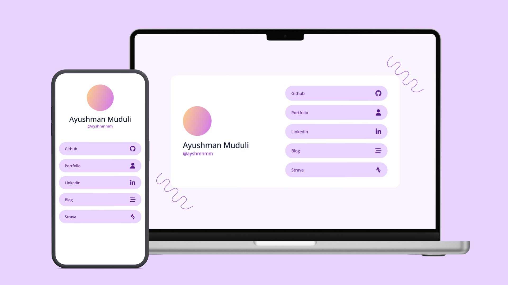

# Linksy


A free linktree alternative, that is fully customizable and open source.

Linksy is a simple landing page, built using TailwindCSS. It is designed to provide a single page with links to your social media profiles and other websites. It is also fully responsive and works on all devices.

See it live [here](https://links.ayushmanmuduli.com)

## Getting Started

To get started, clone the repository and make sure you have [TailwindCSS](https://tailwindcss.com/) installed.

```bash
git clone https://github.com/ayshmnmm/links
cd links
```

- Once you have cloned the repository, you can start editing the `index.html` file to add your own links and social media profiles.
- Edit the `tailwind.config.js` file to change the color scheme and other tailwindCSS settings.
- In order for tailwindCSS to generate the styles, run the following command:

```bash
npx tailwindcss -i ./style.css -o ./out.css --watch
```

- Once you are done, you can build the project using the following command:

```bash
npx tailwindcss -i ./style.css -o ./out.css --minify
```

## Deployment

You can deploy the project to any static hosting service. I personally use [Cloudflare pages](https://pages.cloudflare.com), but you can use any other service like Vercel, Netlify, or Github Pages.

## Contributing

Pull requests are always welcome. For major changes, please open an issue first to discuss what you would like to change.

## License

This project is open source and available under the [MIT License](LICENSE).


